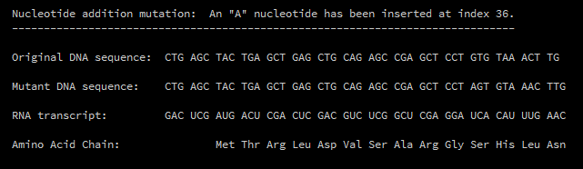

# DNA-Transcriber

A program I made to help me finish biology HW more quickly. It takes a DNA sequence, transcribes it into mRNA, then translates the mRNA into amino acids (this process is called the central dogma of molecular biology). Also allows for mutations in the original DNA sequence.

In addition to biology class, this project was also inspired by the exciting applications of mRNA in COVID-19 vaccines. 

Here are two articles that really piqued my interest: 
- https://www.nytimes.com/interactive/2020/health/moderna-covid-19-vaccine.html
- https://www.nytimes.com/interactive/2020/04/30/science/coronavirus-mutations.html 
